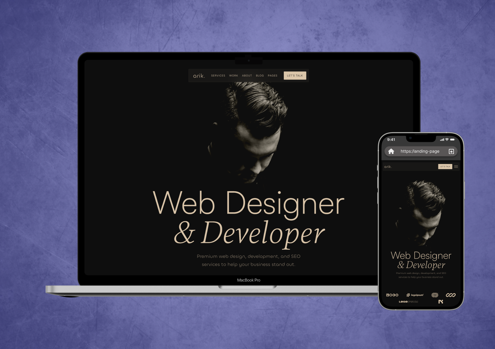

# Portfolio Website Arik - Tailored Digital Solutions for Your Brand
This portfolio showcases a comprehensive approach to crafting visually stunning and highly functional websites. Combining creative web design, custom development, and effective SEO strategies, the projects deliver seamless user experiences and help businesses stand out online. Every solution is personalized to align with the client’s brand voice and target audience, ensuring impactful results without unnecessary complexity.

➼ Technology Stack:
- HTML5 for structure
- CSS3 for styling
- SCSS/Sass for advanced styling and better maintainability
- JavaScript for dynamic functionality
- Gulp for task automation
- Flexbox & Grid for responsive design
- BEM methodology for clean, scalable code

This tech stack ensures a seamless user experience across all devices, providing an intuitive interface with practical elements such as online consultation bookings and informative sections about the clinic’s services and medical team.
